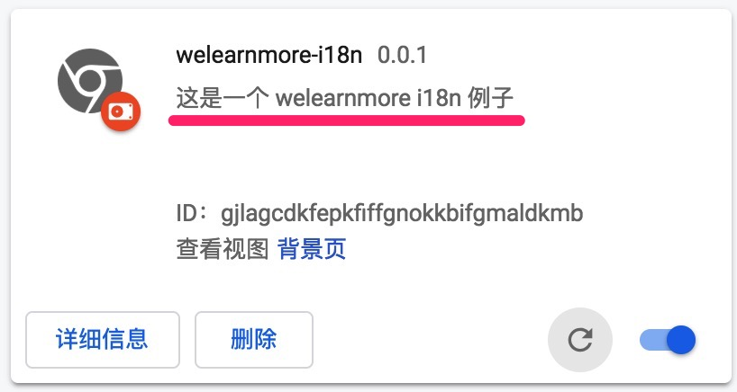

## i18n 介绍

i18n 是 internationalization(国际化) 的首尾字符加中间的 18 个字符，随着产品越做越大，要推向国际的时候，国际化这一步是必不可少的。i18n 的方案有很多，这里只讨论在 Chrome Extension 中的情况。

## i18n 在 Chrome Extension 中应用

Chrome Extension 的 i18n 很方便，基本就是按照下列步骤走。

1. 在 `manifest.json` 中添加 [default_locale](https://github.com/welearnmore/chrome-extension-demos/blob/master/i18n/manifest.json#L9):

  ```json
  {
    "default_locale": "zh_CN"
  }
  ```

2. 在跟目录中新建 `_locales` 文件夹，并且在 [Choosing locales to support](https://developer.chrome.com/webstore/i18n?csw=1#localeTable) 中找到你要支持的语言，比如我们选择支持中文(zh_CN)和英文(en)。然后在 `_locales` 文件夹中再新建 `en` 和 `zh_CN` 文件夹，并且分别在里面新建 `messages.json`:

  ```bash
  - _locales
    |- en
        | - messages.json
    |- zh_CN
        | - messages.json
  ```

  > 这里的 `locales` 、`en` 、`zh_CN`、`messages` 命名是一定要这样的，一个字母都不能错

3. 再来看 `messages.json` 的结构: [zh_CN](https://github.com/welearnmore/chrome-extension-demos/blob/master/i18n/_locales/zh_CN/messages.json) 和 [en](https://github.com/welearnmore/chrome-extension-demos/blob/master/i18n/_locales/en/messages.json)

4. 使用：

  * 在 background 和 content_scripts 中使用 [chrome.i18n.getMessage](https://developer.chrome.com/extensions/i18n#method-getMessage) 调取文案：

    ```javascript
    // 中文系统: hello 变量为 `你好`
    // 英文系统: hello 变量为 `Hi`
    const hello = chrome.i18n.getMessage('HELLO')
    ```

    
    


  * 在 `manifest.json` 中插件名字和描述，格式为 `__MSG_${KEY}__`:

    ```json
    {
      "description": "__MSG_DESC__"
    }
    ```

    
    

<!-- ## 使用 webpack plugin 简化操作

详细请查看  -->